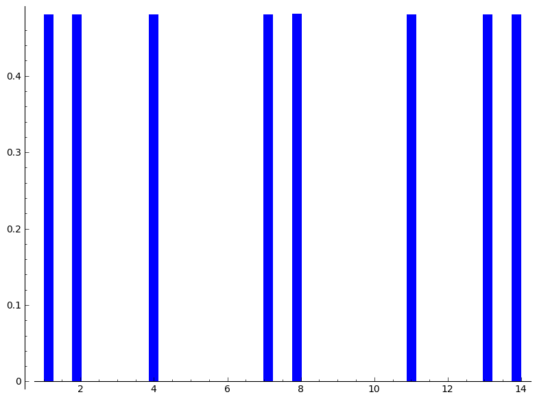
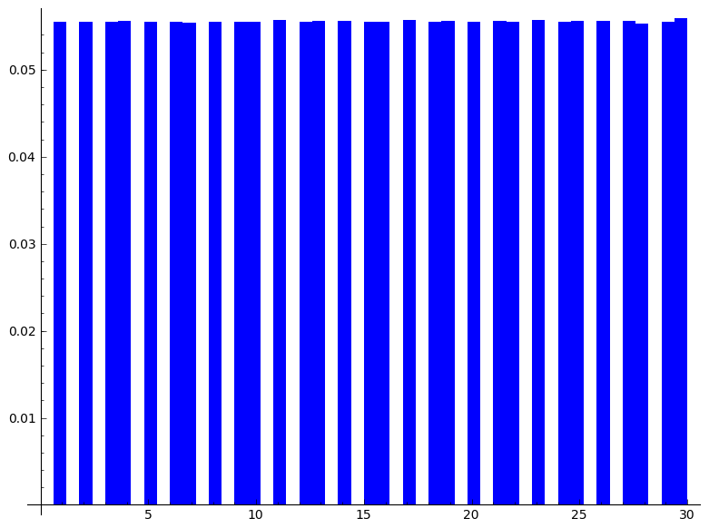

Seongjin Cho (Josh)
===================

Problem 1
---------

Let f(x) = x^2 + a*x + b be a quadratic polynomial with integer 
coefficients, for example, f(x) = x^2+x+6. Formulate a conjecture 
about when the set {f(n) : n in Z and f(n) is prime} is infinite.

Solution:
---------

Some Analysis

Let us consider f. If f can be factored into integer coefficients 
factors, then we know it cannot generate infinitely many prime numbers. 
(In fact, we can create at most one) However, this is not only the 
necessary condition. The f also needs to be not divisible by 2 because
some functions such as x^2 + x + 2 are irreducible but still every integer
we plug-in for f results an even number. I cannot think of any other condition that are necessary. Those conditions are conjectured to be sufficient condition to have infinitely many primes in the image set.

We can extend this argument in more general case where the $f$ is polynomial with any algebraic order. Let's first assume we allow negative prime numbers. In order to satisfy the second condition, we need to make sure the function 
is not divisible by 3. However, We need to be more careful about the second condition because the previous number can be matter. For example, consider function 2*x^3 + x^2 + x + 2. f mod 2 == 0 whatever we plug-in for the domain value. Hence, we conclude that the function should not be divisible for all prime numbers before its algebraic multiplicity. 

<dl>
	<dt>Conjecture</dt>
	<dd>
	f defined as above question, the set {f(n) : n in Z and f(n) is prime} is infinite if it satisfies below conditions:
	1. irreducible to the integer factors,
	2. f should not be a function which is even for all n.
	</dd>
</dl>

Problem 2
---------

Let n=15.  
1. Plot a frequency histogram that shows how the prime numbers up to 
10^7 are distributed modulo n.  
2. Make a conjecture based on your data.  
3. Obtain data for other values of n and make a more general conjecture. 

Solution:
---------

Hmm.. Seems like prime numbers are uniformly distributed. But on some numbers
such as 3, 5, 6, 9, 10, 12, 15, there is one or no primes, 
we can check the reason of this behavior using the definition of modular operation. 
If we take n to be prime number, then all the numbers between 1 to n 
will be relatively prime to n. Hence prime numbers will be uniformly 
distributed on all numbers before positive integer n. Let us check our 
work using sage.

Ahh when I put n = 31 which is also a prime, Prime numbers modulo n
are distributed uniformly on all of the numbers between 1 to 31. So my
conjecture will be,

<dl>
	<dt>Conjecture</dt>
	<dd>
	Prime numbers modulo n are evenly distributed among the natural numbers less than n except at the numbers which is not relatively prime to n.
	</dd>
</dl>

Problem 3
---------

I made up a rational number alpha whose numerator and denominator each 
have 7 digits. Here's two facts about that rational number:
1. it is congruent to 372806624339965 modulo 37+10^15;
2. its decimal expansion begins 0.13869616280169693....
What do you think my rational number is?

Solution
--------

The grand number is ~~~ 1234567/8901234.

It can be calculated by these steps: 
1. use continued_fraction(0.13869616280169693), 
2. find the convergents, 
3. cleverly choose the last fraction which has 7 digits for both 
numerator and denominator (and it is very noticeable too), 
4. and compute mod(numerator,10^15+37)*mod(1/denominator,10^15+37) and 
check whether it is same as 372806624339965. (This above method 
works because 10^15+37 is prime number.)
